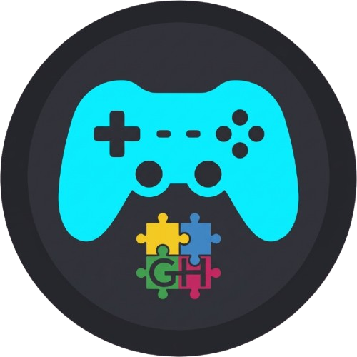

<h1 align="center"> Game Hub </h1>

<br />

<div align="center">
    
</div>

<br />

<div align="center">
    
    
    
</div>
<br />

A collection of browser-based games vibed with **Next.js**, featuring a modern, responsive interface and interactive gameplay experiences.

Currently includes:

* 🧩 **BrainRod** — A multi-round tile-fitting puzzle game inspired by physical spatial reasoning puzzles.

## Features

### 🎯 Game Hub

* Clean and responsive game launcher
* Interactive 3D hover effects
* Smooth animations powered by Framer Motion
* Mobile and desktop friendly
* Easy to extend with additional games

### 🧩 BrainRod

BrainRod is a puzzle game where players must fit a set of pieces into a predefined board shape.

Features include:

* Multiple puzzle layouts
* Multi-round progression system
* Piece rotation support
* Live placement previews
* Touch and mouse controls
* Custom round editor
* Progress tracking between rounds
* Completion celebrations and animations
* Responsive design for desktop and mobile devices

#### Controls

| Action         | Control                     |
| -------------- | --------------------------- |
| Select Piece   | Click / Tap piece           |
| Rotate Piece   | Rotation buttons or `Space` |
| Place Piece    | Click / Tap board           |
| Remove Piece   | Right-click (Desktop)       |
| Remove Piece   | Long press (Mobile)         |
| Deselect Piece | `Esc`                       |

## Tech Stack

* ⚛️ Next.js 15
* React
* TypeScript
* Tailwind CSS
* Framer Motion
* Lucide React

## Installation

Clone the repository:

```bash
git clone https://github.com/yourusername/game-hub.git
cd game-hub
```

Install dependencies:

```bash
npm install
```

## Running Locally

Start the development server:

```bash
npm run dev
```

Open:

```text
http://localhost:3000
```

## Project Structure

```text
src/
├── app/
│   ├── page.tsx          # Game Hub
│   └── brainrod/         # BrainRod game
│
├── components/
    └── thumbnail.tsx

lib/
├── brainrod.ts       # Puzzle definitions, pieces and logic

public/
├── cardverse-online-icon.png
```

## BrainRod Puzzle System

Puzzles are defined through a configuration system consisting of:

* Board dimensions
* Blocked cells
* Available pieces
* Round progression

This makes it easy to create new puzzle packs without changing game logic.

Example concepts:

```ts
{
  boardRows: 6,
  boardCols: 8,
  blackCells: [],
  rounds: [...]
}
```

## Adding New Games

The hub is designed to be expandable.

To add a new game:

1. Create a new route under `app/`
2. Create a thumbnail component or image
3. Add a `GameCard` entry in the hub page
4. Provide navigation logic

